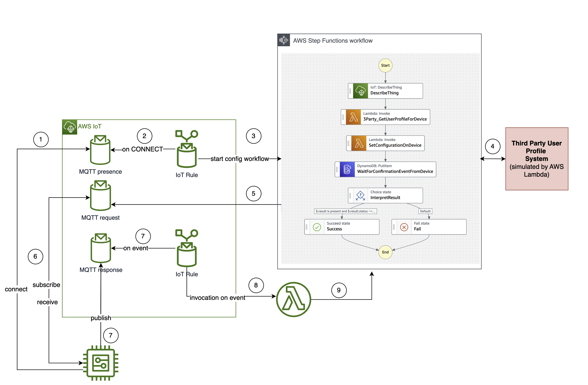
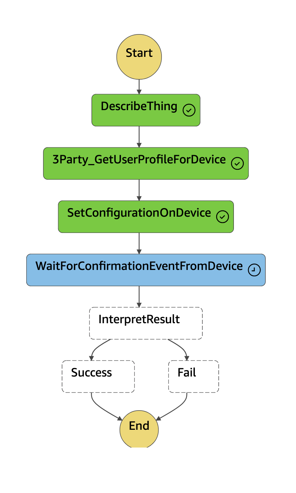
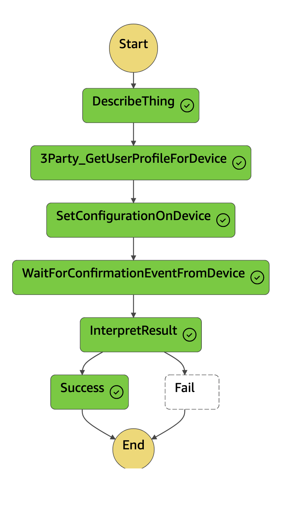

## IoT Configuration Management Workflow Sample 

This project is part of a [blog](https://dev.to/iotbuilders/automatically-applying-configuration-to-iot-devices-with-aws-iot-and-aws-step-functions-part-1-4n13) post.

## How it works

The diagram below describes how the solution works. More details in the blog post linked above.

## Running the demo

**Pre-requisites:**

* You need an AWS Account, with the permissions to deploy an AWS Sam Application with the needed resources.
* AWS SAM CLI installed and configured to work against your AWS Account and Region. More details here: https://docs.aws.amazon.com/serverless-application-model/latest/developerguide/serverless-getting-started.html
* Node.js must be installed on your local machine in order to run the device simulator. Note that the simulator was tested with v17.0.1 of Node.js.
* If you want the simulator to also create the AWS IoT Thing and device identity, you need to set the AWS credentials. You can follow the instructions here (https://docs.aws.amazon.com/sdk-for-javascript/v2/developer-guide/setting-credentials-node.html). The implementation to create the IoT thing and identity is idempotent. You can also create the IoT thing, certificate and key separately, and store the identity in the certs folder, if you prefer.

To create the resources and run the application, follow the following steps:

* Clone the GitHub repo.

* In the root directory, `iot-config-management-sample`, run the following commands:
    `sam build`

     `sam deploy --guided`

* Start the device simulator:
    * Add and validate your configuration in `iot-config-management-sample/device/config.js`:
      `export const config =
          {
          iotEndpoint: '<YOUR IoT Endpoint>',
          clientId: '<YOUR Thing Name>',
          policyName: '<YOUR IoT Policy>',
          verbosity: 'warn',
          region: '<YOUR AWS Region>',
          shouldCreateThingAndIdentity: <true or false> // if true, the simulator will create the AWS IoT Thing and unique identity. Certificate and Key will be stored in certs/
          }`

If your **shouldCreateThingAndIdentity** flag is set to **false**, you need to make sure the IoT thing, certificate and key have already been created, and store the certificate and key in the certs folder prior to running the mqtt client.

* Start the simulator: 
    `npm install simulator.js`

   `node simulator.js`
* If the simulator is successfully started, you should already see that an AWS Step Functions workflow was triggered automatically, once your device successfully connected to AWS IoT. Note that the simulator implements a delay of 10 seconds between receiving the request and sending a successful response.

* Verify that the workflow was successfully triggered:
    * Log into the AWS Console, navigate to AWS Step Functions, find the ConfigManagement State Machine, and explore the execution, as shown in the images below.

## Security

See [CONTRIBUTING](CONTRIBUTING.md#security-issue-notifications) for more information.

## License

This library is licensed under the MIT-0 License. See the LICENSE file.

